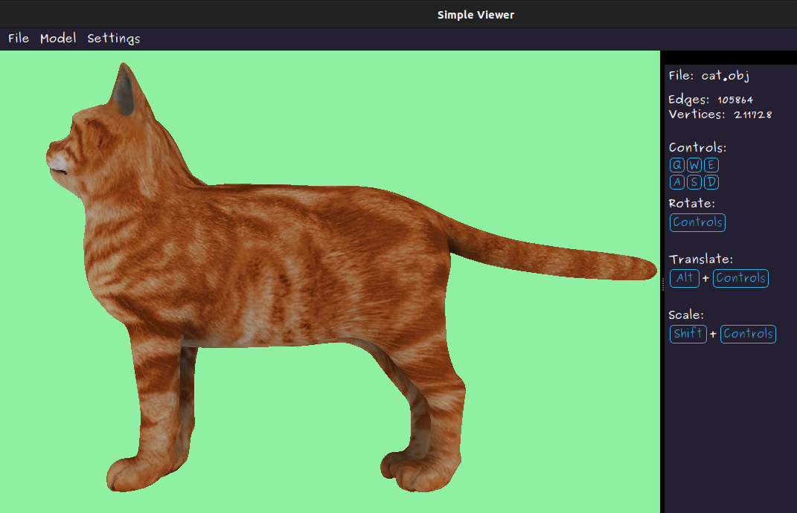
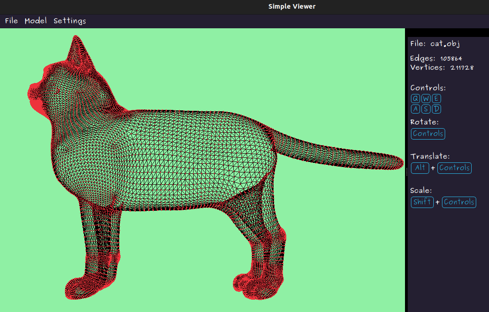
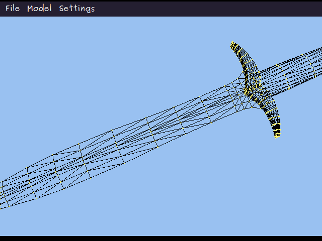

# Simple 3D Viewer Manual

_Last updated December 2024_

## Introduction

This document describes how to install, run, check and remove Simple Viewer on Linux and Unix-like systems. Please note that the program was written and tested on Ubuntu 22.04 LTS, so its behaviour may differ if you use other versions or OS distributions.

## Installation & Running

### Prerequisites

Correct compilation and running of the program depends on other utilities and libraries. Check that you have their latest versions before proceeding: 

| Compilation targets | Utilities |
| ------------------- | --------- |
| App Compilation & Running | gcc, make |
| Desktop Interface | Qt5, qmake |
| Testing | GTest library |
| GCOV Report | gcov, lcov |
| Leaks Check | valgrind |
| Convert Manual to DVI | texi2dvi |

 

### Setup

Download or clone (`git clone <link_to_git_folder>`) the source repository to where you can easily find it. Then type and run the following commands in the terminal: 

1. `cd <path_to_git_folder>/src/viewer`

2. `make install`

Now the program is compiled, placing the app in a folder named `SimpleViewer/`. The app should open automatically. If you want to open it later using command line, run `make viewer`. If there are errors, you're likely missing some packages. Check __Prerequisites__.

 

### Usage

The app layout should be fairly intuitive. On the first load, you'll see a horizontal __Menu Tab__ plus an __Information Tab__ on the right side of the screen. The __Menu Tab__ is divided into three sub-categories and the options you choose are saved after each session:

__> File__

(a) Upload file — _choose .obj file to display_

(b) Save as .bmp, .jpg — _save current render as a picture_

(c) Make screencast — _save current render as a GIF (5sec, 10 frames/sec, 640x480) with custom model rotation_

(d) Exit — _close the app_

 

__> Model__

(a) Rotate — _rotate the model on a given axis by N degrees_

(b) Translate — _translate the model on a given axis by N degrees_

(c) Scale — _scale the model on a given axis by N degrees_

(d) Wireframe — _display model as wireframe (as opposed to solid)_

(e) Parallel projection — _apply parallel projection (as opposed to central, or perspective projection)_

 

__> Settings__

(a) Set background — _change background colour_

(b) Set texture — _choose texture (only in SOLID MODE)_

(c) Vertices — _set colour, size and display mode (circle, square, none) of vertices (only in WIREFRAME MODE)_

(d) Edges — _set colour, size and dashed mode of edges (only in WIREFRAME MODE)_

(e) Show information — _toggle the visibility of the_ __Information Tab__

 

The model is initially displayed in the central part of the screen (__Tip:__ if you can't see your model at first, try changing its dimensions and coordinates. Also check the settings to ensure that the model and background are differently coloured). The __Information Tab__ lists the keys to manipulate your model as well as its number of edges and vertices. Additionally, you can __click and drag the mouse to rotate__ your object and __scroll with the mouse wheel to scale__ it.

Here are some examples of what you can produce with this app:

_A model of a cat (`src/assets/models/cat.obj`) with a texture applied to it (`src/assets/textures/cat.jpg`). [Source](https://free3d.com/3d-model/cat-v1--522281.html)_

 

_And here's the same model in wireframe mode._

 

 
_And here's a rotating wireframe sword model (`src/assets/models/sword.obj`). [Source](https://free3d.com/3d-model/sting-sword-128810.html)_ 

 

## Structure & testing

The program was made using C++17 language and standard libraries, with the interface provided by Qt5. It uses an MVC design structure to separate the interface from the controller and model. The source code can be found in `src/viewer/backend` and `src/viewer/frontend folders`. The backend libraries can be tested with GTest: 

1. To run tests: `make test `

2. To display test coverage: `make gcov_report`

3. To check for leaks: `make valgrind`  

Running `make` or `make all` will reinstall and compile the program. You can get DVI documentation with `make dvi` or a distribution .tar.gz package with `make dist`. 

Also note:

1. Not every model can be processed by this simple app — check `src/assets/models` for inspiration.

2. The basic textures and shaders in `src/assets/textures` and `src/assets/shaders` are needed for the app to function (but you can mod and replace them if you know what you're doing).

3. This app uses external libraries to process .gif, .jpg, .bmp and .obj files: please see `src/external` for licenses.
 
4. All `make` commands should be run from `src/viewer` Use `make clean` to get rid of the post-compilation junk.

 

## Deinstallation

Simply run `make uninstall`. This will remove the `SimpleViewer/` directory but not the original download, which can be safely deleted afterwards.

If you wish to suggest an improvement or report a bug, contact me __@ginzburg_jake (Telegram) or JakeTheSillySnake (GitHub)__.
